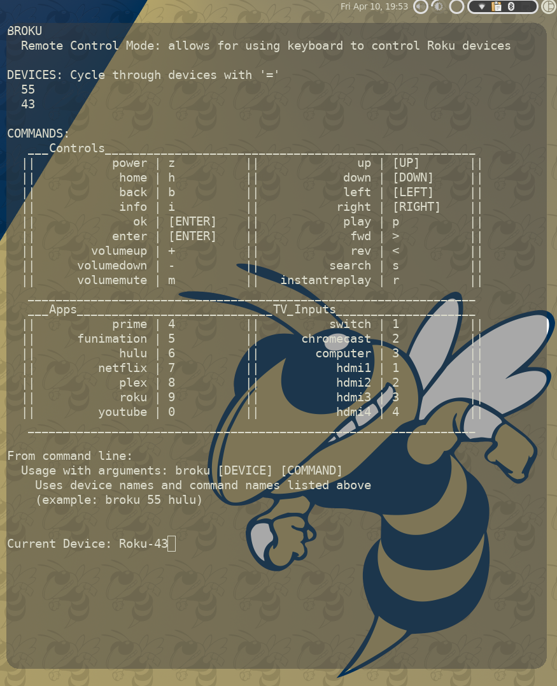

# BRoku - A Bash-Based Roku Remote

#### Still in early stages of development

This script brings bash-based controls for multiple Roku devices to the
terminal.  It uses curl commands from Roku, and it allows for easy
modification to available controls in a \*.json file.

I was using [roku-cli](https://github.com/ncmiller/roku-cli) for Roku controls.  I highly
recommend it for its ease of use, but it didn't have all the commands I was
looking for, namely power and volume controls and app buttons.



### Installation:
In the current state, the repo needs to be stored in ~/Projects/broku.  That
will be fixed later.
```
$ mkdir -p ~/Projects
$ git clone https://github.com/doctriam/broku ~/Projects/broku
$ mkdir -p ~/.local/bin
$ ln -s $HOME/Projects/broku/broku ~/.local/bin/broku
```
##### jq Arch Installation
Requires jq package for reading json file:
```
$ sudo pacman -S jq
```
Haven't tried this on any other distros, but jq is most likely available on
other ones.

##### Add ~/.local/bin to PATH
To directly access commands in your bin folder, verify that '~/.local/bin` is in your PATH:
```
$ printenv | grep PATH
```
and look for the folder in the PATH variable.  If it is not already in PATH,
add this to the bottom of ~/.bashrc:
```
export PATH=$PATH:~/.local/bin
```
To setup devices, open up broku\_args.json in your favorite editor and edit the
devices, giving them a name and an ip address.  You can find the ip address for
each device in the settings on the device under Settings > Network > About.

### Usage:
I finished the terminal remote control.  You can open it by just using:
```
$ broku
```
BRoku can be used in one-shot commands by doing:
```
$ broku [DEVICE] [COMMAND]
```
So, to power on my 55" roku TV and open Hulu, I use:
```
$ broku 55 power && broku 55 hulu

```
To edit the devices or commands that you want to use, edit the broku_args.json
file.  Specifically, change the names to adjust the the arguments that you want
to use to call each device or command.

Included commands are:
* power
* volumeup
* volumedown
* volumemute
* back
* home
* enter/ok
* up
* down
* left
* right
* info
* instantreplay
* search
* fwd
* rev
* play
* prime (Amazon Prime)
* funimation
* hulu
* netflix
* plex
* roku (The Roku Channel)
* hdmi1
* hdmi2
* hdmi3
* hdmi4

I have also included these commands which switch to the Roku TV inputs
* computer
* chromecast
* switch

### One-Shot Terminal Commands
A template has been added for those who prefer a one-shot command such as
powering on a Roku TV.  This is in the repo as broku\_template.sh.  

A one-shot
command can be used, for example, to turn on a TV with a laptop connected to
it without having to track down a remote or even assigned as a keyboard
shortcut to turn on a TV that has a desktop connected to it.
1. Make a copy of the file: 
  ```
  $ cp broku_template.sh brokuOn
  ```
2. Open brokuOn in an editor
3. Replace the IP address in the command with the one for your Roku device
4. Save the file
5. Create a symlink in ~/.local/bin
  ```
  ln -s $HOME/Projects/broku/brokuOn ~/.local/bin/brokuOn
  ```
6. Add the following line to the end of ~/.bashrc
  ```
  export PATH=$PATH:~/.local/bin
  ```
You should now be able to turn on your device by running:
  ```
  $ brokuOn
  ```
You can modify the broku\_template.sh in many ways to run single commands, or
you create a series of commands to perform a particular task on the Roku
device.  See comments in broku\_template.sh for further information.

If you prefer to use [roku-cli](https://github.com/ncmiller/roku-cli) or
another app that doesn't have certain functions, you can create one-shot
commands for the tasks that they don't do.

### Adding Roku App IDs:
To add the apps that you use on your Roku device, call this in terminal:
```
curl http://[device ip address]:8060/query/apps
```
The output will display the app ID and name along with some other info.  Just
add the name and ID to broku\_args.json as follows:
```
{ "name": "[new name]", "cmd": "launch/[app id]" }
```

### Planned improvements:
* Automatic search for device and add
* Automatic add Roku apps
* Command-mode:
  * String multiple commands 
    *  ex: To power on TV and open hulu app:
        ```
        $ broku 55 power hulu
        ```
  * Use default device
    *  ex: If first device is '55', power on using:
        ```
        $ broku power
        ```

### References:
* [roku-cli](https://github.com/ncmiller/roku-cli)
* [developer.roku.com](https://developer.roku.com/docs/developer-program/debugging/external-control-api.md)
